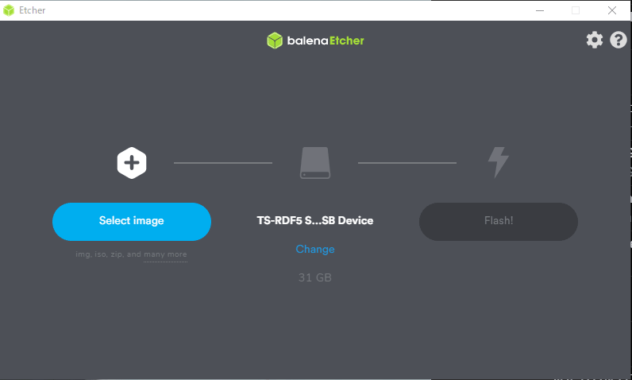
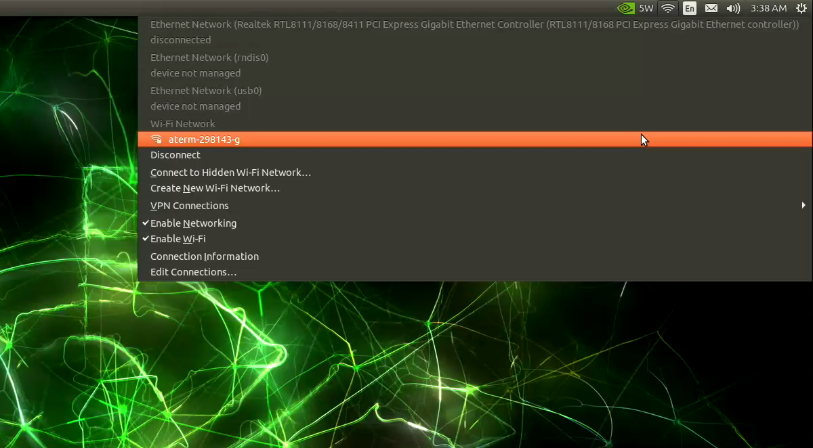
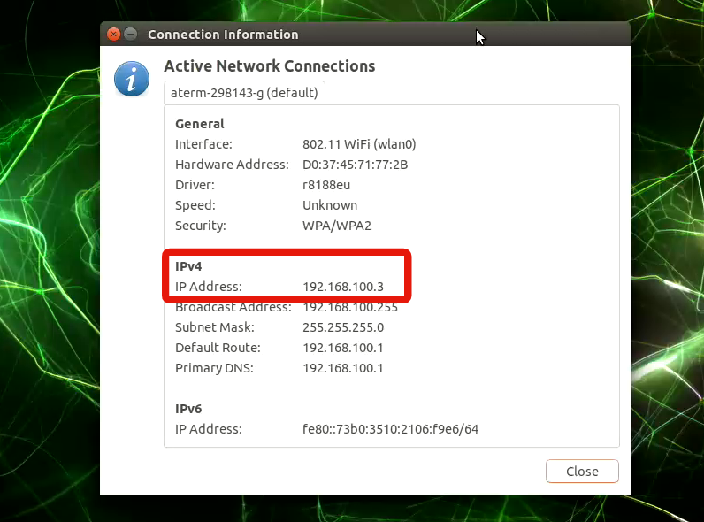

# イメージファイルの書き込み

このページでは、Jetson Nano Mouse用のイメージファイル
の書き込み方法と初期設定について説明します。

このイメージファイルには、
Jetson Nano MouseのLEDやモータを駆動するために必要な
[デバイスドライバ](https://github.com/rt-net/JetsonNanoMouse)
があらかじめインストールされています。

## イメージファイルのダウンロードと書き込み

イメージファイルをダウンロードし、microSDカードに書き込みます。

!!! warning
    micro SDカードの取り付けやJetson Nanoの電源操作時に、
    Jetson NanoやJetson Nano Mouse本体を**故障させないように**注意してください。
    詳細はJetson Nano Mouseの**製品マニュアルを参照してください**。

1. micro SDカードにイメージファイルを書き込むためのアプリケーションを用意します。
ここでは[balenaEtcher](https://www.balena.io/etcher/)を使用します。
1. 下記のリンクをクリックして、イメージファイル(`jnmouse_jp451_v2.zip`)をダウンロードします
    - [https://drive.google.com/open?id=1eyRdJdVfh4DCkAF1h6J93id33Hyb0Blf](https://drive.google.com/open?id=1eyRdJdVfh4DCkAF1h6J93id33Hyb0Blf)
    - zipファイルのサイズは約9GBですが、展開後は約30GBに増えます。
    - イメージファイルの詳細は[「イメージファイルについて」](#about-image-file)を参照してください
2. micro SDカードをPCに接続します
    - **micro SDカードの容量は64GB以上を推奨します**
3. Etcherを起動し、イメージファイルをmicro SDカードに書き込みます
    - 
4. micro SDカードをJetson Nanoに取り付け、Jetson Nano Mouseの電源を入れます


## 初期設定

Jetson Nano Mouseの電源投入後の初期設定について説明します。

### ログインユーザ名とパスワード

ログインユーザ名とパスワードはどちらも`jetson`です。

### ネットワーク設定

無線LANを使用する場合は、画面上のメニューから接続先を設定します。



ネットワーク接続が完了すると、`Connection Information`からIPアドレスを確認できます。




### Jetson Nanoのパフォーマンス設定とブートローダ更新

1. ++ctrl+alt+t++を入力してターミナルを起動します
1. 次のコマンドを実行し、Jetsonのパフォーマンス設定を行います
```sh
$ cd ~/jnmouse_utils/scripts
$ ./configure-jetson.sh
```
1. 次のコマンドを実行し、ブートローダを更新します
```sh
$ cd ~/jnmouse_utils/scripts
$ ./update-qspi.sh
```
    - [「ブートローダについて」](#about-bootloader)に書かれている注意事項も確認してください

### SPI通信の有効化

Jetson NanoのGPIOを設定するためのツールである`Jetson-IO`を使って、`SPI1`を有効にし、
Jetson NanoとJetson Nano Mouseの基板が通信できるようにします。
これによりJetson Nano Mouse前方の距離センサが使えるようになります。

1. 次のコマンドを実行し、Jetson-IOを起動します
```sh
$ sudo /opt/nvidia/jetson-io/jetson-io.py
```
    - Jetson-IOが起動できない場合は、次のコマンドを入力し、修正スクリプトを実行してください
    ```sh
    $ ~/jnmouse_utils/scripts/fix-jetsonio-r3231.sh
    ```
1. `Configure 40-pin expansion header`を選択し、

spi1を有効にするfunctionとして選択します。

function選択後は<code>Back</code>を選び、メニューに戻ります。
<code>Select one of the following options:</code>と言われるので、<code>Save and reboot to reconfigure pins</code>を選択して再起動します。


## デバイスドライバの更新

Jetson Nano Mouseのデバイスドライバを更新する場合は次のコマンドを実行します

```sh
$ cd ~/JetsonNanoMouse
$ git pull origin master
# デバイスドライバのアンインストール
$ sudo make rmmod
# デバイスドライバのビルド
$ make build
# デバイスドライバのインストール
$ sudo make insmod
```

## その他

### イメージファイルについて {: #about-image-file}

Jetson Nano Mouseのイメージファイルは、
Jetson Nano用のOSである[JetPack](https://developer.nvidia.com/embedded/jetpack)をベースに作成しています。
このイメージファイルには、
[Jetson Nano Mouseのデバイスドライバ](https://github.com/rt-net/JetsonNanoMouse)や
機械学習ライブラリの[PyTorch](https://pytorch.org/)と
[Tensorflow](https://www.tensorflow.org/?hl=ja)、
プログラム実行環境である[JupyterLab](https://jupyter.org/)等が
あらかじめインストールされています。

イメージファイルの詳細や最新の情報について知りたい場合はGitHubリポジトリを参照してください。

- セットアップ方法：[https://github.com/rt-net/jnmouse_utils/tree/master/setup-scripts](https://github.com/rt-net/jnmouse_utils/tree/master/setup-scripts)
- イメージファイル作成用スクリプト：[jnmouse-setup-jetpack-4-5-1.sh](https://github.com/rt-net/jnmouse_utils/blob/master/setup-scripts/jnmouse-setup-jetpack-4-5-1.sh)

### ブートローダについて {: #about-bootloader}

ブートローダを更新すると、JetPack 4.5から導入されたQSPI-NORと呼ばれる新しいバージョンのものに置き換わります。

ブートローダを更新すると以下の2つの影響があります。

1. 対象のSDカードのイメージは、JetPack 4.4以前の旧ブートローダを搭載したJetson
Nano開発キットでは動作しなくなります
1. 対象のJetson Nano開発キットは、以前のブートローダを使用したイメージでは動作しなくなります

なお、SDK Managerを使ってJetPack 4.4以前のバージョンを書き込むことでブートローダは元に戻せます。
更新しないで古いバージョンのブートローダを使用することもできますが、その場合は**SPI通信機能が使用できません**。

ブートローダの詳細はNVIDIA社の公開する情報
（[https://developer.nvidia.com/embedded/linux-tegra-r325](https://developer.nvidia.com/embedded/linux-tegra-r325)）
をご確認ください。
